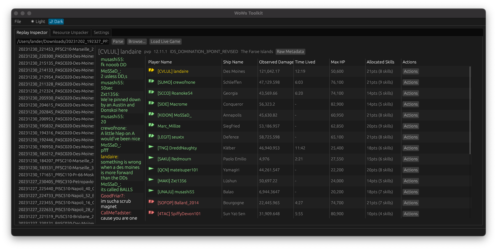
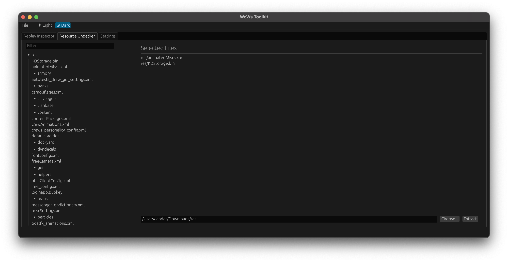
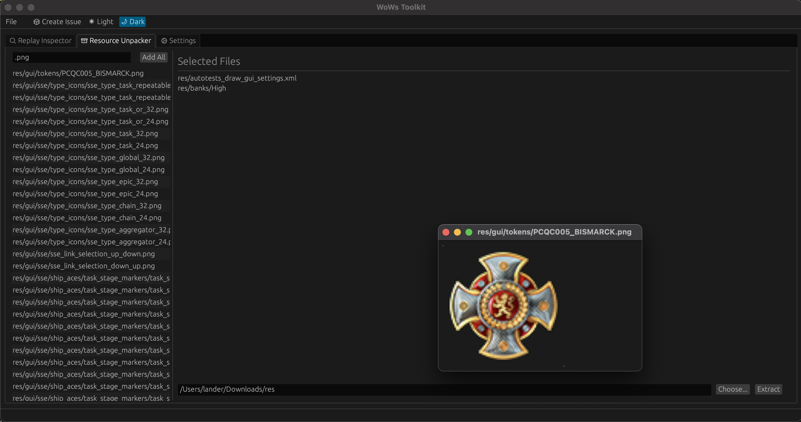

# WoWs Toolkit

This is a toolkit for interacting with World of Warships files

## Community Discussion

If you'd like to discuss the toolkit features, bugs, or whatever, please feel free to open an issue here on GitHub or join the Discord server: https://discord.gg/SpmXzfSdux.

## Pre-Built Application Binaries

Pre-built binaries for Windows are provided at https://github.com/landaire/wows-toolkit/releases/latest Download the `
wows-toolkit_v(VERSION)_x86_64-pc-windows-gnu.zip` file, extract the application somewhere, and you're good to go! For all other platforms you will have to compile yourself.

## Usage

1. Run the application
2. Set the World of Warships directory in the settings tab (defaults to `C:\Games\World_of_Warships` if it exists)
3. ???
4. Do things

The application will automatically check for updates on startup and, if available, will present update details in-app.

This is not considered a World of Warships mod and does not modify your World of Warships install at all. It passively reads game files required for parsing replays, and parses replay files directly.

## Features

- Can read replay files and display statistics such as damage dealt, time lived, spotting damage, and potential damage.
- Can view player builds by clicking the "Actions" button on a player row and choosing to open the build in your web browser.
- Can browse and extract packed game files.
- Automatically sends **builds** (not raw replays) to shipbuilds.com for build statistic gathering from **Randoms** and **Ranked** games. Training rooms are not sent. Sending replay data can be disabled in the application settings tab.

## For Developers

If you do not want to compile the application yourself or make changes to WoWs Toolkit please ignore this section!

To build yourself, make sure you are using the latest version of stable rust by running `rustup update`. Next, simply run `cargo run --release` from the source code directory.

On Linux you need to first run:

`sudo apt-get install libxcb-render0-dev libxcb-shape0-dev libxcb-xfixes0-dev libxkbcommon-dev libssl-dev libgtk-3-dev`

On Fedora Rawhide you need to run:

`dnf install clang clang-devel clang-tools-extra libxkbcommon-devel pkg-config openssl-devel libxcb-devel gtk3-devel atk fontconfig-devel`